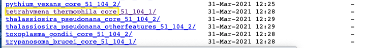

# Website build Stage 1 - Identifier mapping file 

  In the main GeneMANIA instance all identifier mapping is extracted from the mySQL data dumps released by ensembl - 
  
  There is no requirement to have all the specified identifiers or to get your mappings from ensembl but your identifier mapping file for the website build needs to have the following format:
  
  1. GMID	- automatically generated unique genemania identifier.  It is specific to the instance of the website and not to any external database.
  1. Ensembl Gene ID	
  1. Protein Coding	
  1. Gene Name	
  1. Ensembl Transcript ID	
  1. Ensembl Protein ID	
  1. Uniprot ID	
  1. Entrez Gene ID	
  1. RefSeq mRNA ID	
  1. RefSeq Protein ID	
  1. Synonyms	
  1. Definition
  
## How to build your identifier file

In order to build the identifier file we need to create an ensembl mirror for the desired organism, import all the ensembl data and export the desired data into the above specified format.

### Create and setup a container of the ensembl mirror docker instance

The docker instance that we are going to use can be found [here](https://hub.docker.com/repository/docker/baderlab/gmbuild_ensembl) - gmbuild_ensembl.

  1. Install Docker - for instructions see [here](https://docs.docker.com/get-docker/)
  1. check out GeneMANIA_build from the Baderlab github (https://github.com/BaderLab/GeneMANIA_build.git)
  
```{bash, eval=FALSE}
git clone https://github.com/BaderLab/GeneMANIA_build.git
```
  
<ol start=3 type="1">
<li> Create container of gmbuild_ensembl instance.</li>
</ol>

  * each -v parameter specifies a local directory, or volume, that is mapped to a directory on the docker.  For example, the directory /home/gmbuild/ensembl data on your machine gets mapped to the location /home/gmbuild/ensembl_data in the docker container.  Any file that is put into that directory on the docker will show up on the corresponding directory on your machine.
  * There are multiple volumes mapped to the ensembl_mirror
    * /home/gmbuild/ensembl_data --> /home/gmbuild/ensembl_data
    * /home/gmbuild/gmbuild_code_dir/genemania-private --> /home/gmbuild/ensembl_code - This is the directory where you checked out the code in the previous step and contains all the code we will need to build the identifier mapping files.
    * /home/gmbuild/gmbuild_code_dir/genemania-private/Docker_contatiners/Ensembl_docker/custom_cnf --> /etc/mysql/conf.d - configuration files needed for the set up of mySQL instance on the docker. 
    * /home/gmbuild/db_files --> /var/lib/mysql - directory where the mySQL database will store its data files. 
    * With the --name tag you can specify what you would like to call your instance.  This name can be used when logging into the instance. For this example we have called this instance ensembl_mirror.

```{bash, eval=FALSE}
docker run -d
-v /home/gmbuild/ensembl_data:/home/gmbuild/ensembl_data 
-v /home/gmbuild/gmbuild_code_dir/genemania-private:/home/gmbuild/ensembl_code 
-v /home/gmbuild/gmbuild_code_dir/genemania-private/Docker_containers/Ensembl_docker/custom_cnf:/etc/mysql/conf.d 
-v /home/gmbuild/db_files:/var/lib/mysql 
--name ensembl_mirror 
baderlab/gmbuild_ensembl
```
  <ol start=4 type="1">
<li> Once the instance is created, log into it.</li>
</ol>
  
```{bash, eval=FALSE}
docker exec -it ensembl_mirror /bin/bash
```

  <ol start=5 type="1">
<li> Download the ensembl data.</li>
</ol>

  * On the docker you need to change into the directory ensembl_code/ensembl_mirror (remember that actually points to /home/gmbuild/gmbuild_code_dir/genemania-private on your main computer which is the directory containing the code that we downloaded from github.)
  
```{bash, eval=FALSE}
cd ensembl_code
cd ensembl_mirror
```

  * Download the data - There are two separate scrits in the ensembl_code/ensembl_mirror that you can use to download the data.  For a new species you will need to modify the scripts to make them specific for your organism.
  
  1. get_ensembl.sh - this script demonstrates how to download all the species that are currently available in the public GeneMANIA server.  A selection of them are available from the main ensembl ftp site (including human, mouse, fly ....) but some are not (including e-coli and arabidopsis).  This script shows how you need to specify the ftp site depending on the data you are grabbing.
  1. get_ensembl_indiv_species.sh - this script demonstrated how to donwload one example species.  For this example we are using Tetrahymena which is available in ensemblgenomes protists section.  
  
  * Open get_ensembl_indiv_species.sh
  * update script to have the following variables:
    * SPECIES='tetrahymena_thermophila_core'
    * FTP_SITE='ftp.ebi.ac.uk/ensemblgenomes/pub/current/protists/mysql/' 
    
  Depending on the species that you are using the species and the ftp_site variables will be different.  Not all species are available on the ensembl servers (or available to RSync.).  For the tetrahymena example, although the files are listed on the ensemblgenomes ftp site, the files failed to download using rsync.  Changing to the ebi mirror fixed that issue.  
  There are many ftp sites you can check to see where your organism specific files are located.  Ultimately, it depends which division the species falls into.

  1. 'ftp.ensembl.org/pub/current_mysql/'
  1. 'ftp.ensemblgenomes.org/pub/current/plants/mysql/' 
  1. 'ftp.ensemblgenomes.org/pub/current/bacteria/mysql/'
  1. 'ftp.ensemblgenomes.org/pub/current/fungi/mysql/'
  1. 'ftp.ensemblgenomes.org/pub/current/protists/mysql/'
  1. 'ftp.ensemblgenomes.org/pub/current/metazoa/mysql/'
  
  Navigate to the right division and find your species of interest.  There will be additional numbers after the species name associated with the directory name but when setting the species variable just include the species name.  The additional numbers indicate which release these files are associated with.  **Given that you want to get the current release, make sure that you don't include those numbers.**
  
  <p align="center"> </p>
  
  For the above directory found in the protist division we set the following variables:
  
  * SPECIES='tetrahymena_thermophila_core'
  * FTP_SITE='ftp.ensemblgenomes.org/pub/current/protists/mysql/' 

```{bash, eval=FALSE}
./get_ensembl_indiv_species.sh 
```

```{block, type="rmd-troubleshooting"}
**Problem**:
When running *./get_ensembl_indiv_species.sh* nothing happens, the script finishes right away with no output.

**Solution**:
Check to see that you have defined the SPECIES variable correctly.
  * Go to ftp. ensembl.org/pub/current_mysql and check the spelling of your organism's directory.
```

```{block, type="rmd-troubleshooting"}
**Problem**: 
==> Rsync tetrahymena_thermophila_core_51_104_1 FROM ftp.ensemblgenomes.org/pub/current/protists/mysql/:
@ERROR: Unknown module 'pub'
rsync error: error starting client-server protocol (code 5) at main.c(1666) [Receiver=3.1.2]

[[ ERROR ]] : tetrahymena_thermophila_core_51_104_1 -- Trying again...

**Solution**:
The ensembl sites are not always consistent.  Verify that you have got the address right but if the address right and you still get this error try using the ebi mirror instead:

```

  When the script is done running you will find a directory in your ~/ensembl_data directory with today's data.  In that directory you will find all of the ensembl files that were just downloaded.
  
```{bash, eval=FALSE}
ls -r ~/ensembl_data/*/tetrahymena_thermophila_core*
```

  <p align="center"> </p>
  
<ol start=6 type="1">
<li> Load ensembl data into local database.</li>
</ol>

  The next script will take all the files downloaded from ensembl and load them into a local mySQL database.  
  
```{block, type="rmd-tip"}
Using the gmbuild_ensembl docker will help with this step because there is no requirement to install mySQL.  The docker instance comes with a compatible mySQL server. 
```

```{bash, eval=FALSE}
./create_ensembl.sh 
```

```{block, type="rmd-troubleshooting"}

mySQL 8 or greater no longer has INFORMATION_SCHEMA.  If a database was exported from an older version of mySQL there might be references to INFORMATION_SCHEMA and script will crash with error.  You can:

* Update any file containing it from INFORMATION_SCHEMA to  PERFORMANCE_SCHEMA

* Of alternately, Easy fix for this issue.  Open mySQL and run the following command: 
set @@global.show_compatibility_56=ON;
```

<ol start=7 type="1">
<li> Process ensembl data.  Create summary files needed for GeneMANIA</li>
</ol>

  This step creates identifier mapping files as well as shared domain information present in ensembl associated with your species.  Shared domains is not required for the build but they will be automatically created during this step. 

  * Change into the identifier mapping directory.

```{bash, eval=FALSE}
cd ../identifier-mapper-perl/
```

  * modify the runall_indiv_species.sh script to use your newly downloaded species data. - the runall.sh script shows how the main GeneMANIA build processes multiple species.  The runall_indiv_species.sh runs the exact same process but only for one species.  

  Update the line 34 of *runall_indiv_species.sh* to reflect your species of interest:  
  
  * ./idmapper.pl $DATADIR/Work **tetrahymena_thermophila** **Tt** 19
  * This line will call the idmapper perl script with parameters (in the following order, order is important):
  * output directory $DATADIR/Work - don't change. The script automatically detects the newest ensembl data download directory and places the output files there.
  * species name - Change to species of interest.  For this example 'tetrahymena_thermophila'.
  * species two letter code - change to two letters that best represent your species.
  * random number - this is used when generating GeneMANIA unique identifers.  If you have multiple species in your instance make sure that this number is different.  In the above example, all random GeneMANIA identifiers will start with 19 for tetrahymena.
      
      Also, before running the script you need to update the configuration file.  For this example the configuration file is spd_tetra.cfg.  the only thing that needs to be updated in this file is the **spd_org** variable.

```{block, type="rmd-tip"}
You can choose to modify the spd_tetra.cfg file or create a new file specific for you organims.  If you create a new file for your organism make sure to update runall_indiv_species.sh line 37 to reflect the new file name.

./1.export_spd_from_ensembl.sh $ensembl_version spd_tetra.cfg

to

./1.export_spd_from_ensembl.sh $ensembl_version <new_spd_config_filename.cfg>
```      
      
      
```{bash, eval=FALSE}
[BuildScriptsConfig]
# this section is for the configuration for the build process script
# ___[revision]_________________________________________
revision = R2

# ensembl releases to use
ensembl_core_release =104
ensembl_plants_release =51
ensembl_metazoa_release =51
ensembl_bacteria_release =51

#had to move this because of issues with get_spd.pl script
# mysql host, username, password
mysql_h = localhost
mysql_u = root
mysql_p = gm.build

# shared protein domain organisms
spd_org = tetrahymena_thermophila

```
      
      
```{bash, eval=FALSE}
./runall_indiv_species.sh
```

  Once the script is finished running you will have the following files and directories (It will exist both on the docker and on the computer that the docker is running on.  Its location on main computer depends on what you set *-v /home/gmbuild/ensembl_data:/home/gmbuild/ensembl_data* in the docker run command) :

```{bash, eval=FALSE}
ls ~/ensembl_data

ensembl_data/
  July_23_2021/
    current_build.log  
    tetrahymena_thermophila_core_51_104_1/
    Work/  
      ENSEMBL_ENTREZ_Tt  
      Tt_done.txt	
      spd/
        interpro/
        pfam/
```  
  
  The *ENSEMBL_ENTREZ_Tt* file is the identifier mapping file.  If you have additional identifier mapping data that is not present in Ensembl you can modify this file directly (make sure to keep the overall structure) but, for example, Tetrahymena maintains gene names that are not incorporated into Ensembl.  (table of gene names can be found here - http://ciliate.org/index.php/show/namedgenes)  Through Scripting or Excel you can add these gene symbols to the *ENSEMBL_ENTREZ_Tt*.  
  
  **Main output of this step is the directory with all its files.  This directory will be mapped onto the main genemania data build docker and used in subsequent steps.**
```{bash, eval=FALSE}
~/ensembl_data/July_23_2021/Work
```

  The ~/ensembl_data/July_23_2021/Work/spd directory contains shared domains networks computed from the ensembl data.  Under the *spd* directory there are two directories (interpro and pfam) each containing a directory for the organism(s) being analyzed with the shared domain interactions.
